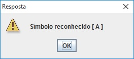

### PatternRecog
Pattern Recognition

Programa destinado a reconhecer padrões desenhados no grid.

### Características
 - Pode servir como OCR
 - Inspirado no algoritmo mapa auto-organizáveis, mais conhecidos como Self-Organizing Maps, desenvolvido por Teuvo Kohonen
 - Servir de base para outros projetos ou estudos que envolvam redes neurais artificiais

### Executando
 - Depois de feito o download do projeto, o programa pode ser executado com um simples duplo-clique em dist/PatternRecog.jar  
 - Pode também ser chamado direto via linha de comando: java -jar PatternRecog.jar 
 - O programa não necessita de nenhuma biblioteca externa 
 - Requisito mínimo para o correto funcionamento: Máquina Virtual Java - JRE 7.0 

### Reconhecendo padrões
 - Primeiro são inseridos padrões: 
 - Desenhe um padrão no grid, por exemplo a letra A, conforme o exemplo abaixo: 

 - Em seguida clique em adicionar, será solicitado o símbolo que o padrão representa 
 - Depois de gravado no mínimo 2 padrões/símbolos pode se treinar o programa 
 - Uma vez treinado, o usuário pode desenhos no grid e clicar em reconhecer 
 - Se o padrão desenhado for parecido com a letra A como no exemplo, a resposta deverá ser como na imagem: 

OBS.: Padrões que divergem muito da letra que foi inserida podem apresentar falhas na tentativa de reconhecimento 

